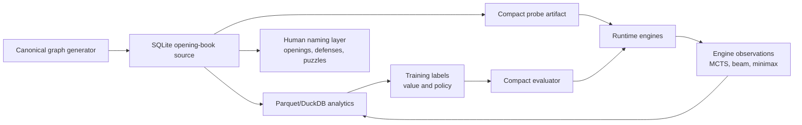

# Opening Book Scale, Storage, and Proficiency Tradeoffs for Quantik

Date: 2026-07-13

Status: research note for contract design

## Executive Summary

Quantik should treat the opening book as a compact game graph with learned
policy/value annotations, not as a flat list of named lines and not as an
attempt to store every raw board. The best early design is:

1. A contracted SQLite knowledge graph for canonical positions, legal edges,
   policy priors, solved values, forcedness, and provenance.
2. Parquet or DuckDB analytical logs for observations, engine-vs-engine games,
   Elo experiments, and model training data.
3. A later compact probe artifact for engines, analogous in role to Syzygy
   tablebase probing in chess engines, but much smaller and tailored to Quantik.
4. A small value/policy model trained from search and solved slices, because it
   should deliver more practical strength per megabyte than storing deeper and
   deeper explicit opening data.

The practical recommendation is to build a complete depth-6 canonical graph
first, add selective depth-7 and depth-8 coverage around high-value openings,
forced lines, confusing defenses, and puzzle-worthy tactics, then train a
compact evaluator from that data. A multi-gigabyte artifact is acceptable, but
the highest expertise-per-byte path is not simply "make the book bigger." It is
"store the graph facts once, compress the policy, learn the evaluation, and keep
human naming as a separate sparse layer."

## What We Know Locally

The current Quantik Rust census gives a useful lower bound on scale. These
counts are canonical positions by ply, not raw legal histories.

| Ply | Canonical positions | Raw ongoing transitions | Elapsed in current census |
| --- | ---: | ---: | ---: |
| 1 | 3 | 64 | negligible |
| 2 | 51 | 3,392 | negligible |
| 3 | 726 | 167,552 | negligible |
| 4 | 10,946 nonterminal | 6,770,048 | 0.27 s |
| 5 | 105,632 | 230,833,152 | 2.9 s |
| 6 | 901,916 | 6,159,946,752 | 26.0 s |
| 7 | 4,658,465 | 128,513,710,080 | 140.1 s |
| 8 | 17,900,160 | 1,978,186,364,928 | 570.1 s |

The cumulative canonical node count through ply 8 is about 23.6 million. That
number is small enough for local storage, but large enough that schema choices
matter. It is also important that "raw ongoing transitions" already reaches
about 2 trillion at ply 8, which means a raw-history representation is the wrong
mental model. Quantik is a graph problem: canonical positions are nodes, legal
moves are edges, symmetries collapse equivalent states, and policy/value data
lives on nodes and edges.

The current exact-solve path is not yet a scalable book builder. A depth-4
exact-solve pilot estimated about 12.7 days as-is because each position solve
rebuilds search state. A shared transposition table or retrograde pipeline is
expected to be one to two orders of magnitude cheaper for the same work, but
that improvement must be measured before committing to exhaustive deeper solve
runs.

## What Stockfish Does

Stockfish is a useful reference mostly because of what it does not do. Modern
Stockfish does not carry a giant built-in opening database as its core strength.
It relies on search, evaluation, a transposition hash, and optional Syzygy
endgame tablebases. The UCI options expose `Hash`, `SyzygyPath`,
`SyzygyProbeDepth`, `SyzygyProbeLimit`, `UCI_LimitStrength`, and `UCI_Elo`,
which shows the separation between runtime memory, optional perfect endgame
knowledge, and calibrated reduced-strength play. See the official Stockfish UCI
documentation:

- https://official-stockfish.github.io/docs/stockfish-wiki/UCI-%26-Commands.html

In Stockfish source, Syzygy support is implemented as WDL and DTZ tablebase
probing from compressed files, memory-mapped on demand and looked up through
specialized indexes. It is not a general graph database inside the engine. See:

- https://github.com/official-stockfish/Stockfish/blob/master/src/syzygy/tbprobe.cpp

The lesson for Quantik is not "copy chess tablebase sizes." Chess Syzygy files
are huge because chess has many pieces, piece types, captures, promotions,
fifty-move-rule semantics, and a much larger late-game state space. Quantik's
state space is different and much more symmetry-friendly. The useful lesson is
architectural: keep exact table knowledge probeable, compact, optional, and
separate from the engine's normal search.

## Entry Types And Size Model

The storage design should distinguish hot engine data from cold analytical data.
The following estimates are intentionally conservative. They are meant for
contract sizing, not for claiming a final binary format.

### Position Node

A compact node can be represented with:

| Field | Compact size | Notes |
| --- | ---: | --- |
| Canonical key | 16-24 B | Bitboard-derived key or hash plus collision guard. |
| Depth, side, flags | 2-8 B | Terminal, solved, representative, version flags. |
| Game value | 1-4 B | Loss/draw/win or scalar score. |
| Visit and outcome stats | 12-32 B | Visits, wins, losses, draws, or compressed counters. |
| Policy summary | 8-64 B | Best move, top-k moves, entropy, confidence. |
| Provenance | 4-16 B | Generator, engine, checkpoint, budget id. |

Compact lower bound: about 48-96 B per node.

SQLite practical bound: about 200-500 B per node once row overhead, indexes,
variable-length fields, and page fragmentation are included.

The engine-facing format should avoid storing QFEN on every hot node. QFEN is
excellent for interchange and inspection, but a compact board encoding or
canonical key should be the lookup surface. QFEN can be stored in a side table,
debug export, or analytical artifact.

### Edge

An edge represents one legal move from a canonical parent to a canonical child.
At minimum it needs:

| Field | Compact size | Notes |
| --- | ---: | --- |
| Child reference | 4-8 B | Integer node id is denser than repeated key. |
| Move/action | 1-2 B | Shape and target cell fit in a byte if encoded. |
| Edge flags | 1-2 B | Forced, book-approved, illegal-after-transform guard. |
| Policy/counts | 4-32 B | Prior, visits, winrate, rank, or optional top-k stats. |

Compact lower bound: about 8-40 B per stored edge.

SQLite practical bound: about 40-120 B per edge with parent/child indexes.

Edges dominate if all legal moves are stored at every node. If only top-k moves
and forced moves are stored, the book becomes much smaller but loses exact graph
navigation.

### Naming And Book Lines

Opening names, defense names, puzzle themes, and book chapters should be sparse
metadata over the graph, not embedded in every node. The likely structure is:

- `line_id`
- `name`
- `variation_name`
- `root_node`
- `principal_variation`
- `tags`
- `curator_notes`
- `source`

This layer is small. Even 100,000 named or tagged positions with human-readable
text would likely stay below a few hundred megabytes. It should be optimized for
editing and publishing, not engine probing.

### Observation And Elo Data

Observation data is different from book data. Engine-vs-engine games, search
traces, MCTS visits, beam candidates, minimax depths, wall-clock budgets, and
checkpoint identifiers form an event log. That should live in JSONL for fixtures
and Parquet or DuckDB for scale. It should not be loaded by the engine as a book.

## Size Caps: What We Get At Each Scale

These are planning estimates. "Elo proxy" means expected relative improvement
against the same engine without this artifact, not an externally measured chess
Elo equivalent. Actual numbers must be calibrated later with self-play and
head-to-head tournaments.

| Size cap | Likely contents | Player/recommender value | Elo proxy |
| --- | --- | --- | ---: |
| 10 MB | Named roots, compact depth-4 summaries, a few curated lines and puzzles. | Good human documentation; weak direct play improvement. | +10 to +30 |
| 100 MB | Complete depth-4/depth-5 canonical stats, top-k policy, tactical motifs, first puzzle corpus. | Useful opening recommender and early educational book. | +40 to +100 |
| 1 GB | Complete depth-6 graph in compact form, or SQLite with selective edges and stats. | Stronger early-game play, reliable avoidance of simple traps. | +100 to +200 |
| 5-10 GB | Depth-6 full plus selective depth-7/depth-8 graph, richer edge statistics, forced-line indexes. | Strong practical book, good puzzle generator, useful named defenses. | +150 to +300 |
| 30-80 GB | Near-complete depth-8 graph with edge stats, plus analytical aggregates and training labels. | High coverage, but diminishing returns unless used to train/evaluate models. | +200 to +400 |
| 100+ GB | Experimental exhaustive tablebase-like artifacts, dense policies, repeated search traces. | Possible research value; likely poor expertise per byte unless compressed. | uncertain |

The main inflection point is around depth 6. It is large enough to capture real
opening structure and small enough to keep iteration fast. Depth 7 and depth 8
are valuable, but they should be selected by information value rather than
stored blindly in the first production book.

## Candidate Storage Approaches

The database cheatsheet at https://cheatsheets.davidveksler.com/databases.html
is consistent with the practical split Quantik needs: relational storage where
schema and consistency matter, columnar storage for analytics, and specialized
stores for high-throughput key-value probing.

### SQLite Knowledge Graph

SQLite is the right first contract target for the opening book. It is embedded,
single-file, ACID, easy to inspect, and good for local read-heavy workflows. It
also supports indexes over parent/child edges, resumable generation, and
incremental migrations. Its weakness is high-concurrency writing, not single-user
book construction or engine probing.

Use SQLite for:

- Canonical positions.
- Parent-child edges.
- Solved values and confidence.
- Best moves and top-k policy.
- Human naming overlays.
- Generator provenance.
- Resumable local workflows.

Avoid using SQLite as the primary format for:

- Massive search trace logs.
- ML training corpora.
- Dense tensors.
- High-throughput multi-process writes.

### Parquet Or DuckDB Analytics

Parquet and DuckDB are better for observations and experiments: self-play games,
MCTS visit tables, h2h tournament results, feature extraction, and Elo
calibration. They are columnar and compress repeated fields well. They are not
ideal as the runtime engine lookup format because random graph probing is not
their core strength.

Use them to answer:

- Which openings win most under MCTS vs minimax?
- Which defenses collapse under deeper search?
- Which positions produce high disagreement across engines?
- Which book lines deserve names?
- Which labels should train the evaluator?

### LMDB, RocksDB, Or Sled-Like Key-Value Stores

A key-value store can be a better engine-facing artifact than SQLite once the
schema stabilizes. The key can be the canonical position key; the value can be a
packed policy/value payload. This is efficient, mmap-friendly, and simple to
probe from Rust.

Tradeoff: it is less transparent than SQLite, and migrations are more painful.
It should be generated from the contracted SQLite/Parquet sources, not become
the source of truth too early.

### Postgres

Postgres becomes attractive when opening names, Elo leaderboards, puzzle review,
collaborative annotation, or a web product need concurrent users. It is not the
best first local engine artifact. If Quantik later grows a hosted opening
explorer, Postgres can own the collaborative layer while SQLite or compact
artifacts remain the engine layer.

### Graph Databases

The user's intuition is correct: the domain is a graph. That does not imply a
graph database is the best storage engine. Quantik needs extremely compact,
canonical, deterministic adjacency plus numeric annotations. A relational
adjacency table or packed key-value payload will likely outperform a general
graph database for this workload.

Graph database ideas are still useful conceptually:

- Nodes are canonical positions.
- Edges are legal moves.
- Edge weights are priors, visit counts, win rates, or forcedness.
- Named openings are paths or subgraphs.
- Puzzles are subgraphs with a target tactic or forced result.

### Custom Tablebase Artifact

A custom tablebase-like artifact is the eventual high-performance format:

- Fixed-width node ids.
- Packed WDL or scalar values.
- Optional distance-to-result or depth-to-proof.
- Compressed edge/action masks.
- Memory-mapped pages.
- Versioned header and checksum.

This should come after the SQLite contract teaches us which fields are actually
needed. Building it first would optimize before the semantics are stable.

### Neural Value/Policy Model

The most memory-efficient route to stronger play is likely a small neural or
linear evaluator trained from search, solved slices, and observation data. The
book provides exact or high-confidence labels; the model generalizes outside the
stored graph. A model in the 1-100 MB range could eventually outperform a much
larger static book for positions just outside stored coverage.

This does not replace the book. It changes the book's role:

- The book supplies exact starts, traps, and named theory.
- The model supplies generalization.
- Search verifies and sharpens choices.

## Transfer Learning From Search, Evaluation, And Tablebases

Quantik should use generated data in three layers.

First, solved or near-solved positions become value labels. If a position is a
forced win/loss under exact search, that is a high-confidence target.

Second, MCTS/beam/minimax observations become policy labels. Visit counts,
principal variations, minimax best moves, and cross-engine agreement can train a
policy prior. This mirrors the policy/value split used by AlphaZero-style and
Lc0-style engines. Lc0's technical overview describes a neural network returning
policy and value, with MCTS using those outputs to guide search:

- https://lczero.org/dev/wiki/technical-explanation-of-leela-chess-zero/

Third, tablebase-like slices become probeable exact knowledge. Stockfish uses
Syzygy WDL/DTZ probing for endgames; Quantik can use WDL-style values for solved
canonical subspaces. Quantik probably does not need to store a DTZ equivalent
for every position early. For play strength, WDL plus a best-move policy is
usually more valuable per byte than full distance metadata. For book writing and
puzzles, distance-to-proof is useful, but can be stored selectively.

A useful research direction is graph search rather than tree search. The
Monte-Carlo Graph Search paper generalizes AlphaZero's tree search into a DAG
representation to reuse transpositions and propagate information more
efficiently:

- https://arxiv.org/abs/2012.11045

Quantik is especially suited to this because symmetries and transpositions are
central. The opening book should therefore store a DAG, and engines should reuse
that DAG during search rather than repeatedly rediscovering equivalent states.

## Memory-Efficient Strategies From Other Games

### Chess: Search Plus Evaluation Plus Optional Tablebases

Stockfish is the model for separating concerns. Runtime strength comes from
search and evaluation. Transposition hash is RAM. Syzygy is optional exact
endgame knowledge. Opening books are usually external. Quantik should copy that
separation rather than copy chess data sizes.

### Lc0, AlphaZero, And Go Engines: Policy/Value Generalization

Go and neural chess engines cannot store the solution space. They compress
expertise into a policy/value model and use search to refine it. This is likely
the best long-run path for Quantik if the goal is small-space expertise.

For Quantik, the book can produce much cleaner labels than Go self-play because
the state space is smaller and more enumerable. That makes transfer learning
particularly attractive.

### Checkers: Opening Book, Search, Evaluation, Endgame Database

The Chinook checkers architecture combined an opening book, deep search,
evaluation, and endgame databases. The lesson is that solved or nearly solved
games still benefit from a layered engine. A book alone is not the engine; it is
one source of high-confidence knowledge.

### Othello/Reversi: Pattern Evaluation And Compact Tables

Othello engines often use pattern-based evaluation, move ordering, transposition
tables, and opening books. This suggests another compact Quantik option:
hand-engineered or learned pattern features over piece shapes, blocked cells,
threats, and forced placements. Pattern tables can be tiny compared with a deep
explicit graph.

## Compute Cost Estimates

Current enumeration through depth 8 took about 570 seconds in the local census.
Depth 9 did not complete within a 40-minute attempt. Enumeration is therefore
manageable to depth 8 and uncertain beyond that without algorithmic changes.

Exact solving is the expensive part. The current depth-4 exact-solve path
estimated about 12.7 days because it repeatedly solves positions without a
shared transposition table. The first scalability target should be a shared DAG
solver:

- Generate canonical graph once.
- Store integer node ids and legal edges.
- Process terminal/solved leaves.
- Propagate values backward.
- Cache bounds and proof status.
- Record provenance and confidence.

Approximate compute stages:

| Stage | Goal | Expected cost with current tools | Expected cost after DAG/TT improvements |
| --- | --- | --- | --- |
| A | Complete depth-6 graph and heuristic policy. | Minutes. | Minutes. |
| B | Exact or high-confidence depth-4/depth-5 values. | Days if solved naively. | Minutes to hours. |
| C | Complete depth-7 selective policy and traps. | Hours. | Hours, possibly less with reuse. |
| D | Complete depth-8 graph artifact. | Tens of minutes for enumeration, more for edges/stats. | Similar enumeration, better downstream solve. |
| E | Full exact deeper tablebase. | Not practical yet. | Research project after compact DAG solver. |

The near-term cost bottleneck is not disk. It is solver architecture.

## Recommended Contract Additions

The contracts should describe an opening book as a graph and make the following
concepts explicit:

- `opening_book_id` and semantic version.
- `canonical_key` format and collision policy.
- `node_id` as an optional dense local id for compact storage.
- `position_encoding` separate from human-readable QFEN.
- `depth_ply`.
- `terminal_status`.
- `game_value`: loss/draw/win or scalar value from the side-to-move perspective.
- `value_confidence`.
- `solved_status`: unsolved, bounded, exact, tablebase, inferred.
- `policy`: ranked moves, priors, visits, entropy, and source.
- `forcedness`: forced win, forced defense, only legal move, tactical trap, or none.
- `edge`: parent, child, action, prior, visits, result stats.
- `symmetry_transform` or representative guard for move translation.
- `source`: minimax, beam, MCTS, human, retrograde, neural checkpoint.
- `generation_budget`: depth, rollouts, nodes, time, seed, engine version.
- `line_annotation`: opening/defense names, tags, principal variation, notes.

The existing SQLite shape in Rust is a good starting point, but the contract
should avoid making QFEN the hot key and should reserve room for policy
compression, provenance, and human naming.

## Opening Book Depth Recommendation

The first production opening book should be:

- Complete through depth 6.
- Exact or high-confidence through depth 4/depth 5 after shared solver work.
- Selective through depth 7 and depth 8.
- Nameable from depth 2 through depth 6, because those positions are legible to
  humans and suitable for book-style theory.
- Puzzle-oriented at tactical depths where forced lines appear.

Do not make "complete depth 8 SQLite with every stat" the first milestone. Depth
8 is feasible as a research artifact, but it may not be the best expertise per
byte. A complete depth-6 graph plus selective depth-8 plus a learned evaluator
is likely stronger in less space.

## Proposed Architecture

The source of truth is not a single database file forever. It is a set of
contracted artifacts with different jobs:

- SQLite for inspectable graph truth.
- Parquet/DuckDB for experiments and learning.
- Compact key-value or tablebase artifact for fast engine probing.
- Model checkpoint for generalization.
- Human annotation layer for named theory.

## Could We Do Better?

Yes. The better approach is not necessarily larger. It is more structured:

1. Use the graph nature of Quantik directly.
2. Store canonical positions once.
3. Store sparse policy and forcedness instead of dense traces everywhere.
4. Use retrograde or shared-transposition solving instead of independent
   per-position minimax.
5. Train a compact policy/value model from generated data.
6. Keep named openings and defenses as a sparse editorial layer.

If the goal is an Elo system, puzzles, and a book of named openings, then the
book must support both machine strength and human meaning. Those are adjacent
but not identical. The machine layer wants compact values, priors, and probes.
The human layer wants names, motifs, refutations, defenses, and memorable
principal variations. Keeping them separate lets Quantik grow in both
directions without paying the storage cost of putting prose into every node or
the product cost of hiding theory inside opaque binary blobs.

## Near-Term Decision

Adopt SQLite as the contracted opening-book source format now, but design it as
a canonical DAG and not merely as a table of best moves. Build the first
milestone around complete depth 6, selective depth 7/depth 8, and exact solved
slices. In parallel, emit Parquet/DuckDB observation datasets and train a small
policy/value evaluator. Revisit compact key-value or tablebase artifacts after
the SQLite schema has survived one full generation-and-consumption cycle.

This path keeps the project compatible with multi-gigabyte research artifacts
while optimizing for the smaller, more important target: the most Quantik
expertise per byte.

